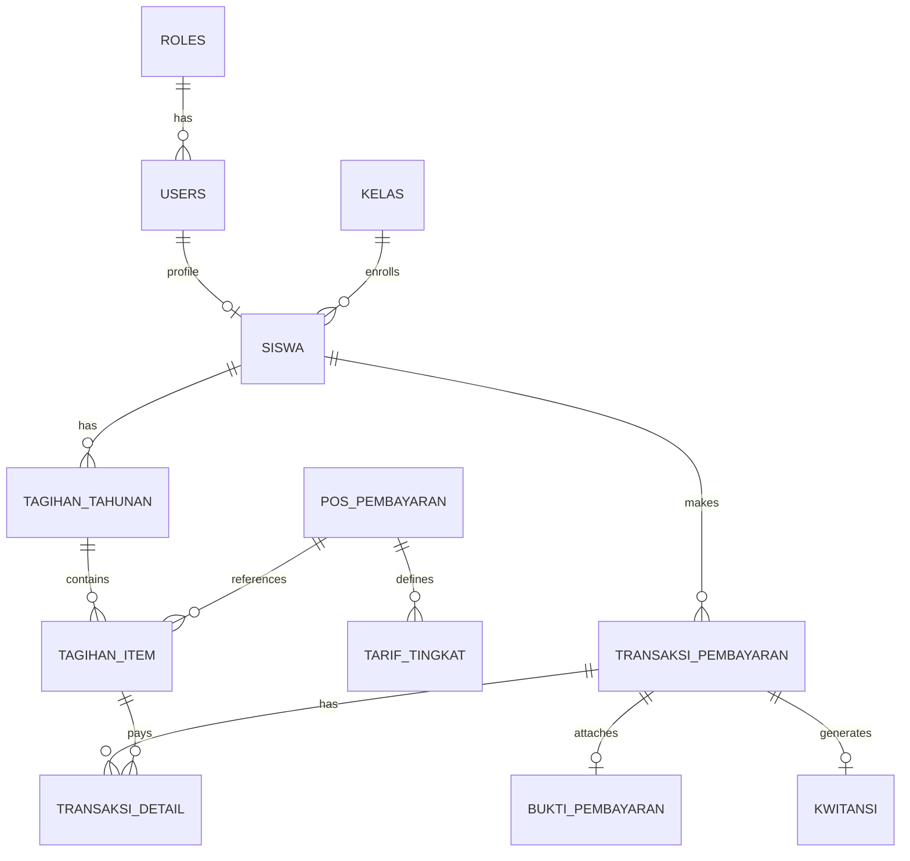

# PRD — Sistem Informasi Pembayaran Siswa SMK Muhammadiyah Sekampung

## 0. Cara AI Harus Membaca Dokumen Ini

Dokumen ini adalah sumber kebenaran teknis dan fungsional (*Single Source of Truth*) untuk pengembangan aplikasi ini.

Saat mengeksekusi kode, AI wajib:
- Mengikuti struktur, relasi database, dan kebutuhan bisnis yang tertulis di PRD ini.
- Menjaga scope agar tetap fokus ke MVP terlebih dahulu tanpa menambahkan *over-engineering* fitur di luar scope.
- Mengutamakan keamanan (RBAC, CSRF, Form Request, Policy, sanitasi file), integritas transaksi (`DB::transaction`, `DECIMAL`), maintainability, dan kemudahan penggunaan.
- Menggunakan Bahasa Indonesia untuk antarmuka pengguna, label, notifikasi, dan pesan validasi.
- Mengimplementasikan panel admin Bendahara menggunakan **Laravel Filament** dan antarmuka Siswa menggunakan **Laravel Blade + Tailwind CSS**.

---

# 1. Overview

## Nama Project
**Sistem Informasi Pembayaran Siswa SMK Muhammadiyah Sekampung**

## Deskripsi Singkat
Aplikasi web berbasis Laravel 12 untuk mengelola administrasi keuangan dan pembayaran siswa di SMK Muhammadiyah Sekampung secara terpusat, transparan, dan terstruktur.

Sistem digunakan oleh dua entitas utama:
1. **Bendahara (Admin):** Mengelola master data siswa, kelas, tarif & jenis tagihan tahunan per tingkatan kelas, pencatatan pembayaran tunai (*direct verification*), verifikasi pembayaran transfer & bukti pembayaran, penerbitan kwitansi transaksi, rekapitulasi pembayaran, dan ekspor laporan ke Excel.
2. **Siswa:** Melakukan registrasi akun mandiri dengan validasi data master (NISN/Tanggal Lahir), melihat rincian tagihan tahunan per pos, memilih pos yang dicicil (*Itemized Allocation*), melakukan pembayaran transfer dengan kode unik pembayaran, mengunggah bukti transfer, melihat status verifikasi secara realtime, riwayat cicilan, serta mengunduh kwitansi resmi PDF ber-kop sekolah per transaksi yang terverifikasi.

## Informasi Sekolah
- **Nama Sekolah:** SMK Muhammadiyah Sekampung
- **Alamat:** JL. RAYA SEKAMPUNG, Giri Kelopo Mulyo, Kec. Sekampung, Kab. Lampung Timur, Lampung

## Target User
1. **Bendahara:** Pengelola administrasi keuangan sekolah (Panel Filament).
2. **Siswa:** Pengguna yang melakukan registrasi mandiri, melihat tagihan, membayar cicilan, mengunggah bukti, dan mengunduh kwitansi (Portal Siswa berbasis Blade + Tailwind).

## Masalah yang Diselesaikan
- Data pembayaran siswa yang sebelumnya dicatat manual di buku kas rawan selisih, hilang, atau sulit direkap.
- Kesulitan siswa/wali murid mengetahui sisa tanggungan tagihan tahunan secara transparan dan rincian pos apa saja yang belum lunas.
- Proses verifikasi transfer manual memakan waktu karena bendahara kesulitan mencocokkan mutasi tanpa sistem kode unik transaksi.
- Pembuatan kwitansi manual yang lambat dan rentan duplikasi nomor kwitansi.
- Kebutuhan rekapitulasi data keuangan cepat yang dapat diekspor langsung ke format Microsoft Excel.

## Value Proposition
Mengotomatiskan alur penagihan tahunan, cicilan berbasis alokasi item (*Itemized Partial Payment*), verifikasi transfer dengan kode unik, pencatatan otomatis kwitansi ber-kop sekolah, dan rekapitulasi data keuangan sekolah yang akurat dan dapat dipertanggungjawabkan.

## Success Metrics (MVP)
- Bendahara dapat mengelola tarif pembayaran per tingkatan kelas (X, XI, XII).
- Siswa dapat mengklaim akun (Self-Registration) menggunakan NISN & Tanggal Lahir yang valid.
- Siswa dapat memilih pos yang ingin dicicil dan mendapatkan kode unik transfer acak 3 digit.
- Pembayaran tunai langsung tercatat lunas seketika oleh bendahara.
- Pembayaran transfer melalui alur verifikasi berkas bukti oleh bendahara.
- Kwitansi resmi berformat PDF ber-kop sekolah langsung terbit otomatis per transaksi cicilan yang disetujui.
- Rekapitulasi transaksi dapat diekspor ke file Excel (.xlsx) dengan filter dinamis.

---

# 2. Tech Stack & Arsitektur

## Frontend & User Interface
- **Portal Siswa:** Laravel 12 Blade Views, Tailwind CSS, Alpine.js (desain modern, responsif untuk smartphone, tablet, dan desktop).
- **Panel Bendahara:** **Laravel Filament** (Admin Panel native Laravel yang modern, elegan, dan kaya fitur tabel, form, filter, widget, dan chart).
- **PDF Engine:** `barryvdh/laravel-dompdf` untuk mencetak kwitansi resmi PDF ber-kop sekolah.
- **Excel Engine:** `maatwebsite/excel` atau `openspout` untuk ekspor rekapitulasi data transaksi ke Excel (.xlsx).

## Backend
- **Framework:** **Laravel 12 (PHP 8.2+)**
- **Database ORM:** Laravel Eloquent ORM.
- **Validation:** Laravel Form Request & Model-level rules.
- **Security & Authorization:** Laravel Gates & Policies (Strict RBAC).
- **Storage:** Laravel Storage Local / Public Disk untuk penyimpanan bukti transfer.
- **Transaction Safety:** `DB::transaction()` pada setiap operasi mutasi keuangan.

## Database
- **Engine:** MySQL 8.x / MariaDB
- **Standar:**
  - Foreign Key Constraints & Cascade/Restrict Protection.
  - Tipe data nominal moneter: `DECIMAL(12, 2)` (menghindari floating point error).
  - Indexing pada kolom query: `nisn`, `nomor_transaksi`, `nomor_kwitansi`, `status`, `created_at`.
  - Soft Deletes pada tabel data master (Siswa, Kelas, Jenis Tagihan).

---

# 3. Business Logic & Workflow Rules

### 1. Registrasi Akun Siswa (Self-Registration via Opsi B)
1. Bendahara memasukkan data master siswa (Nama, NISN, NIS, Kelas/Tingkat, Tanggal Lahir, Jenis Kelamin).
2. Siswa membuka halaman Registrasi Akun di Portal Siswa.
3. Siswa menginput **NISN** dan **Tanggal Lahir**.
4. Sistem memvalidasi apakah data siswa ada di database dan belum memiliki akun login `user_id`.
5. Jika valid, siswa melengkapi data: Username/Email & Password.
6. Sistem membuat entitas `User` (role: `siswa`), menautkannya ke record `Siswa`, dan mengarahkan siswa ke dashboard.

### 2. Struktur Tagihan Tahunan & Rincian Pos (Itemized Allocation)
- Tagihan dibuat per **Tahun Ajaran** untuk setiap siswa berdasarkan **Tingkat Kelas (X, XI, XII)**.
- Setiap tingkatan kelas memiliki rincian pos tarif standar:
  1. SPP (Bulanan / Tahunan)
  2. Daftar Ulang
  3. Uang Baju / Seragam
  4. Infaq
  5. Dana Kegiatan
  6. Prakerin / PKL
  7. Uji Kompetensi Kejuruan (UKK)
  8. Study Tour / Kunjungan Industri
  *(Bendahara dapat menambah jenis pos tagihan baru kapan saja).*
- **Itemized Partial Payment (Cicilan berbasis Pos):**
  - Saat melakukan pembayaran (baik Tunai di loket maupun Transfer), ditentukan pos mana saja yang dibayar dan nominal per pos-nya.
  - Sisa tagihan tiap pos berkurang sesuai pembayaran yang disetujui.
  - Status pos: `belum_lunas`, `sebagian`, atau `lunas`.
  - Status tagihan tahunan siswa secara agregat otomatis berubah menjadi `lunas` bila seluruh pos telah 100% dibayar.

### 3. Logika Pembayaran Transfer Manual & Kode Unik
1. Siswa memilih rincian pos yang akan dicicil (misal: SPP Rp 150.000 + Infaq Rp 50.000 = Total Rp 200.000).
2. Sistem men-generate **Kode Unik Transaksi** 3 digit acak (100 - 999), contoh: `428`.
3. Total transfer yang wajib ditransfer siswa: **Rp 200.428**.
4. Informasi rekening bank sekolah (Nama Bank, No Rekening, Atas Nama) ditampilkan jelas beserta batas waktu transfer (1x24 jam).
5. Siswa mengunggah foto/dokumen bukti transfer.
6. **Alokasi Nilai Transaksi:** Nominal yang mengurangi sisa tagihan siswa adalah nominal murni tagihan (**Rp 200.000**), sedangkan kode unik berfungsi sebagai identifikasi mutasi di rekening bank sekolah.
7. Transaksi berstatus `menunggu_verifikasi`.
8. Bendahara memeriksa bukti dan mutasi bank, lalu menekan **Setujui** atau **Tolak** (disertai alasan).

### 4. Logika Pembayaran Tunai (Cash di Loket)
1. Siswa datang ke loket bendahara sekolah.
2. Bendahara membuka panel Filament menu **Pencatatan Pembayaran Tunai**.
3. Bendahara memilih Siswa, memilih pos tagihan yang ingin dibayar, dan memasukkan nominal uang yang diterima.
4. Sistem memproses dalam `DB::transaction()`:
   - Membuat record `TransaksiPembayaran` (metode: `tunai`, status: `terverifikasi`, `verified_by`: bendahara saat itu).
   - Memotong sisa tagihan tiap pos.
   - Menerbitkan record `Kwitansi` secara otomatis.
   - Kwitansi langsung dapat dicetak / diunduh PDF seketika.

### 5. Penerbitan Kwitansi Resmi PDF
- Kwitansi diterbitkan **per transaksi cicilan yang disetujui (terverifikasi)**.
- Format Nomor Kwitansi: `KWT/TAHUN/BULAN/XXXX` (Unique, sequential).
- Konten Kwitansi PDF:
  - **Kop Surat Resmi SMK Muhammadiyah Sekampung** (Logo, Nama Sekolah, Alamat, Kontak).
  - Nomor Kwitansi & Tanggal Transaksi.
  - Identitas Siswa (Nama Lengkap, NISN/NIS, Kelas, Jurusan).
  - Tabel Rincian Pos yang Dibayar pada transaksi tersebut.
  - Total Pembayaran (Angka & Terbilang Bahasa Indonesia).
  - Ringkasan Sisa Tanggungan Tagihan Siswa saat ini.
  - Tanda Tangan Digital / Keterangan Bendahara Penerima.

### 6. Rekapitulasi & Ekspor Laporan Excel
- Bendahara dapat memfilter data transaksi berdasarkan:
  - Rentang Tanggal (`from_date` s.d. `to_date`).
  - Tingkat / Kelas.
  - Jenis/Pos Pembayaran.
  - Metode Pembayaran (`tunai` / `transfer`).
  - Status Transaksi (`terverifikasi`, `menunggu_verifikasi`, `ditolak`).
- Fitur **Export to Excel (.xlsx)** menghasilkan spreadsheet rapi berisi:
  - Sheet 1: Rincian Transaksi Pembayaran.
  - Sheet 2: Rekapitulasi per Pos Tagihan & Persentase Pelunasan per Kelas.

---

# 4. Data Model & Database Schema



### 1. Table: `roles`
- `id` (BIGINT UNSIGNED, PK, AUTO_INCREMENT)
- `name` (VARCHAR(50), UNIQUE) — values: `bendahara`, `siswa`
- `display_name` (VARCHAR(100))
- `created_at`, `updated_at` (TIMESTAMP)

### 2. Table: `users`
- `id` (BIGINT UNSIGNED, PK, AUTO_INCREMENT)
- `role_id` (BIGINT UNSIGNED, FK -> `roles.id`)
- `name` (VARCHAR(255))
- `username` (VARCHAR(100), UNIQUE)
- `email` (VARCHAR(255), UNIQUE, NULLABLE)
- `password` (VARCHAR(255))
- `status` (ENUM('aktif', 'nonaktif'), DEFAULT 'aktif')
- `remember_token` (VARCHAR(100), NULLABLE)
- `created_at`, `updated_at` (TIMESTAMP)

### 3. Table: `kelas`
- `id` (BIGINT UNSIGNED, PK, AUTO_INCREMENT)
- `nama_kelas` (VARCHAR(100)) — Contoh: "X TKJ 1", "XI AKL 2", "XII TBSM"
- `tingkat` (ENUM('X', 'XI', 'XII'))
- `jurusan` (VARCHAR(100)) — Contoh: "Teknik Komputer & Jaringan", "Akuntansi", "Teknik Bisnis Sepeda Motor"
- `status` (ENUM('aktif', 'nonaktif'), DEFAULT 'aktif')
- `created_at`, `updated_at` (TIMESTAMP), `deleted_at` (SOFT_DELETES)

### 4. Table: `siswa`
- `id` (BIGINT UNSIGNED, PK, AUTO_INCREMENT)
- `user_id` (BIGINT UNSIGNED, FK -> `users.id`, NULLABLE, UNIQUE)
- `kelas_id` (BIGINT UNSIGNED, FK -> `kelas.id`)
- `nisn` (VARCHAR(20), UNIQUE)
- `nis` (VARCHAR(20), UNIQUE)
- `nama_lengkap` (VARCHAR(255))
- `jenis_kelamin` (ENUM('L', 'P'))
- `tempat_lahir` (VARCHAR(100), NULLABLE)
- `tanggal_lahir` (DATE)
- `alamat` (TEXT, NULLABLE)
- `nomor_telepon` (VARCHAR(20), NULLABLE)
- `nomor_telepon_wali` (VARCHAR(20), NULLABLE)
- `status_siswa` (ENUM('aktif', 'lulus', 'pindah', 'keluar'), DEFAULT 'aktif')
- `foto` (VARCHAR(255), NULLABLE)
- `created_at`, `updated_at` (TIMESTAMP), `deleted_at` (SOFT_DELETES)

### 5. Table: `pos_pembayaran`
- `id` (BIGINT UNSIGNED, PK, AUTO_INCREMENT)
- `kode_pos` (VARCHAR(50), UNIQUE) — Misal: `SPP`, `DAFTAR_ULANG`, `SERAGAM`, `INFAQ`, `PRAKERIN`, dll.
- `nama_pos` (VARCHAR(255)) — Misal: "Sumbangan Pembinaan Pendidikan (SPP)", "Uang Seragam & Atribut"
- `keterangan` (TEXT, NULLABLE)
- `is_active` (BOOLEAN, DEFAULT TRUE)
- `created_at`, `updated_at` (TIMESTAMP), `deleted_at` (SOFT_DELETES)

### 6. Table: `tarif_pembayaran` (Tarif per Tingkat)
- `id` (BIGINT UNSIGNED, PK, AUTO_INCREMENT)
- `pos_pembayaran_id` (BIGINT UNSIGNED, FK -> `pos_pembayaran.id`)
- `tahun_ajaran` (VARCHAR(20)) — Contoh: "2025/2026", "2026/2027"
- `tingkat` (ENUM('X', 'XI', 'XII'))
- `nominal` (DECIMAL(12, 2))
- `created_at`, `updated_at` (TIMESTAMP)
- UNIQUE (`pos_pembayaran_id`, `tahun_ajaran`, `tingkat`)

### 7. Table: `tagihan_tahunan`
- `id` (BIGINT UNSIGNED, PK, AUTO_INCREMENT)
- `nomor_tagihan` (VARCHAR(50), UNIQUE) — Misal: `TAG-2026-X-0012`
- `siswa_id` (BIGINT UNSIGNED, FK -> `siswa.id`)
- `tahun_ajaran` (VARCHAR(20))
- `total_tagihan` (DECIMAL(12, 2))
- `total_terbayar` (DECIMAL(12, 2), DEFAULT 0.00)
- `sisa_tagihan` (DECIMAL(12, 2))
- `status` (ENUM('belum_lunas', 'sebagian', 'lunas'), DEFAULT 'belum_lunas')
- `created_at`, `updated_at` (TIMESTAMP)

### 8. Table: `tagihan_item` (Rincian Pos dalam Tagihan Siswa)
- `id` (BIGINT UNSIGNED, PK, AUTO_INCREMENT)
- `tagihan_tahunan_id` (BIGINT UNSIGNED, FK -> `tagihan_tahunan.id`, ON DELETE CASCADE)
- `pos_pembayaran_id` (BIGINT UNSIGNED, FK -> `pos_pembayaran.id`)
- `nominal_pos` (DECIMAL(12, 2))
- `nominal_terbayar` (DECIMAL(12, 2), DEFAULT 0.00)
- `sisa_pos` (DECIMAL(12, 2))
- `status` (ENUM('belum_lunas', 'sebagian', 'lunas'), DEFAULT 'belum_lunas')
- `created_at`, `updated_at` (TIMESTAMP)

### 9. Table: `transaksi_pembayaran`
- `id` (BIGINT UNSIGNED, PK, AUTO_INCREMENT)
- `nomor_transaksi` (VARCHAR(50), UNIQUE) — Misal: `TRX-20260820-0001`
- `siswa_id` (BIGINT UNSIGNED, FK -> `siswa.id`)
- `tagihan_tahunan_id` (BIGINT UNSIGNED, FK -> `tagihan_tahunan.id`)
- `tanggal_transaksi` (DATETIME)
- `metode_pembayaran` (ENUM('tunai', 'transfer'))
- `nominal_pokok` (DECIMAL(12, 2))
- `kode_unik` (INT, DEFAULT 0) — 3 digit acak jika transfer (cth: 342)
- `total_transfer` (DECIMAL(12, 2)) — `nominal_pokok + kode_unik`
- `status` (ENUM('menunggu_verifikasi', 'terverifikasi', 'ditolak', 'dibatalkan'), DEFAULT 'menunggu_verifikasi')
- `catatan_siswa` (TEXT, NULLABLE)
- `catatan_bendahara` (TEXT, NULLABLE)
- `verified_by` (BIGINT UNSIGNED, FK -> `users.id`, NULLABLE)
- `verified_at` (DATETIME, NULLABLE)
- `created_at`, `updated_at` (TIMESTAMP)

### 10. Table: `transaksi_detail` (Alokasi Pembayaran per Pos)
- `id` (BIGINT UNSIGNED, PK, AUTO_INCREMENT)
- `transaksi_pembayaran_id` (BIGINT UNSIGNED, FK -> `transaksi_pembayaran.id`, ON DELETE CASCADE)
- `tagihan_item_id` (BIGINT UNSIGNED, FK -> `tagihan_item.id`)
- `pos_pembayaran_id` (BIGINT UNSIGNED, FK -> `pos_pembayaran.id`)
- `nominal_bayar` (DECIMAL(12, 2))
- `created_at`, `updated_at` (TIMESTAMP)

### 11. Table: `bukti_pembayaran`
- `id` (BIGINT UNSIGNED, PK, AUTO_INCREMENT)
- `transaksi_pembayaran_id` (BIGINT UNSIGNED, FK -> `transaksi_pembayaran.id`, ON DELETE CASCADE)
- `nama_bank_pengirim` (VARCHAR(100), NULLABLE)
- `nama_pemilik_rekening` (VARCHAR(150), NULLABLE)
- `nomor_rekening_pengirim` (VARCHAR(50), NULLABLE)
- `file_path` (VARCHAR(255))
- `file_type` (VARCHAR(50))
- `file_size` (INT)
- `uploaded_at` (DATETIME)
- `created_at`, `updated_at` (TIMESTAMP)

### 12. Table: `kwitansi`
- `id` (BIGINT UNSIGNED, PK, AUTO_INCREMENT)
- `transaksi_pembayaran_id` (BIGINT UNSIGNED, FK -> `transaksi_pembayaran.id`, UNIQUE)
- `nomor_kwitansi` (VARCHAR(50), UNIQUE) — Misal: `KWT/2026/08/0001`
- `tanggal_terbit` (DATETIME)
- `diterbitkan_oleh` (BIGINT UNSIGNED, FK -> `users.id`)
- `file_path_pdf` (VARCHAR(255), NULLABLE)
- `created_at`, `updated_at` (TIMESTAMP)

### 13. Table: `pengaturan_sekolah` (School & Bank Settings)
- `id` (BIGINT UNSIGNED, PK, AUTO_INCREMENT)
- `nama_sekolah` (VARCHAR(255), DEFAULT 'SMK Muhammadiyah Sekampung')
- `alamat_sekolah` (TEXT)
- `nomor_telepon` (VARCHAR(50))
- `email_sekolah` (VARCHAR(100))
- `nama_bank` (VARCHAR(100)) — Contoh: "Bank Syariah Indonesia (BSI) / BRI"
- `nomor_rekening` (VARCHAR(100))
- `atas_nama_rekening` (VARCHAR(150))
- `logo_path` (VARCHAR(255), NULLABLE)
- `nama_bendahara` (VARCHAR(150))
- `nip_bendahara` (VARCHAR(50), NULLABLE)
- `created_at`, `updated_at` (TIMESTAMP)

---

# 5. Modul & Fitur Aplikasi

## Modul 1 — Portal Siswa (Blade + Tailwind CSS)
1. **Self-Registration (Klaim Akun):**
   - Validasi NISN + Tanggal Lahir terhadap data master siswa di database.
   - Buat username dan password baru.
2. **Dashboard Siswa:**
   - Ringkasan profil diri, kelas, dan jurusan.
   - Kartu statistik: Total Tagihan Tahun Ini, Total Sudah Dibayar, Sisa Tanggungan.
   - Status tagihan secara visual (Progress bar pelunasan).
3. **Menu Tagihan & Cicilan:**
   - Tabel rincian per pos: Tarif, Terbayar, Sisa, Status.
   - Checklist/Form pemilihan pos yang ingin dicicil beserta input nominal per pos.
4. **Checkout & Pembayaran Transfer:**
   - Kalkulasi subtotal + auto-generate 3-digit unik.
   - Tampilan nomor rekening sekolah & tombol salin nomor rekening/nominal.
   - Countdown timer masa berlaku pembayaran (24 jam).
   - Form upload foto bukti transfer (Validasi: JPG/PNG/PDF, Max 2MB).
5. **Riwayat Transaksi & Download Kwitansi:**
   - Daftar seluruh transaksi cicilan beserta status (`Menunggu Verifikasi`, `Terverifikasi`, `Ditolak`).
   - Tombol **Unduh Kwitansi PDF** untuk setiap transaksi yang berstatus `Terverifikasi`.

## Modul 2 — Panel Bendahara (Laravel Filament)
1. **Dashboard Analytics:**
   - Widget Total Siswa Aktif, Total Pemasukan Hari Ini, Bulan Ini, dan Tahun Ajaran Berjalan.
   - Widget Transaksi Pending (Menunggu Verifikasi).
   - Grafik Pemasukan per Bulan & Diagram Alokasi per Pos Pembayaran.
2. **Resource Siswa & Kelas:**
   - CRUD Siswa (Import/Export, Filter per Kelas, Status Siswa).
   - CRUD Kelas & Jurusan (Tingkat X, XI, XII).
3. **Resource Master Tarif & Pos Pembayaran:**
   - CRUD Pos Pembayaran (SPP, Seragam, Infaq, dll).
   - Matriks Setting Tarif Pembayaran per Tingkat Kelas per Tahun Ajaran.
   - Tombol *Generate Tagihan Tahunan Siswa Masal* (otomatis membuat tagihan bagi seluruh siswa di tingkat tertentu sesuai tarif).
4. **Resource Transaksi & Verifikasi Pembayaran:**
   - Antarmuka Verifikasi Bukti Transfer: Pratinjau gambar bukti bayar, perbandingan nominal pokok & kode unik, tombol aksi satu klik *Approve* (otomatis potong saldo tagihan & terbitkan kwitansi) atau *Reject* (dengan catatan alasan).
   - Menu **Pencatatan Pembayaran Tunai (Loket):** Form cepat untuk mencatat pembayaran kasir loket sekolah dengan penerbitan kwitansi instan.
5. **Resource Kwitansi:**
   - Daftar nomor kwitansi yang telah terbit.
   - Fitur cetak ulang / unduh PDF kwitansi.
6. **Laporan & Rekapitulasi Keuangan:**
   - Filter kustom multi-parameter.
   - Tombol **Export Excel (.xlsx)** berstandar akuntansi sekolah.
7. **Pengaturan Sekolah & Rekening Bank:**
   - Konfigurasi Nama Sekolah, Alamat, Logo, Kop Surat, Rekening Bank Tujuan, dan Identitas Bendahara Penandatangan.

---

# 6. UI / UX Design Guidelines

### Tema Visual & Design System
- **Warna Identitas:** Deep Slate Navy (`#0F172A`), Emerald Green (`#059669` / `#10B981`) melambangkan transparansi keuangan dan identitas sekolah, serta Neutral Warm Grays.
- **Tipografi:** Modern Inter / Plus Jakarta Sans dari Google Fonts.
- **Komponen Portal Siswa:**
  - Card berbasis Glassmorphism halus dengan shadow lembut.
  - Micro-interactions dan visual feedback saat tombol diclick atau nominal dihitung.
  - Form upload bukti transfer dengan *drag-and-drop* and live preview gambar sebelum submit.
  - Status badge yang jelas:
    - 🟢 `Lunas` / `Terverifikasi` (Green)
    - 🟡 `Sebagian` / `Menunggu Verifikasi` (Amber/Yellow)
    - 🔴 `Belum Lunas` / `Ditolak` (Red/Rose)

---

# 7. Roadmap Implementasi (Step-by-Step)

```text
Phase 1: Environment & Core Database Foundation
  ├── Install Filament Panel & package pendukung (laravel-dompdf, excel)
  ├── Setup Migrations lengkap dengan relasi & foreign key
  ├── Buat Seeders (Roles, User Admin Bendahara, Data Kelas, Data Siswa Contoh, Pos Pembayaran & Tarif Awal)
  └── Setup Model relationships & cast data type

Phase 2: Panel Bendahara (Filament Resources)
  ├── Konfigurasi Filament Dashboard & School Settings
  ├── Resource Kelas, Siswa, Pos Pembayaran, & Tarif Pembayaran
  ├── Logic Otomasi Pembuatan Tagihan Tahunan Siswa
  └── Fitur Kasir Pembayaran Tunai (Loket) & Penerbitan Kwitansi Otomatis

Phase 3: Portal Siswa (Blade + Tailwind + Alpine.js)
  ├── Alur Autentikasi Siswa & Self-Registration (Klaim Akun via NISN + Tanggal Lahir)
  ├── Dashboard Siswa & Tampilan Status Tagihan Tahunan
  ├── Alur Checkout Cicilan (Itemized Allocation) + Generator Kode Unik Transfer
  ├── Form Upload Bukti Transfer & Validasi Berkas
  └── Halaman Riwayat Transaksi & Status Verifikasi

Phase 4: Alur Verifikasi & Penerbitan Kwitansi PDF
  ├── Filament Action: Verifikasi Bukti Transfer (Approve/Reject + DB Transaction)
  ├── Service Generator Kwitansi PDF ber-kop surat resmi sekolah
  └── Download Kwitansi PDF di sisi Siswa dan Bendahara

Phase 5: Laporan Rekapitulasi Excel & Polishing
  ├── Export Excel (.xlsx) Transaksi & Rekap Keuangan
  ├── Security Review (Form Requests, Policies, File Storage authorization)
  └── Testing & Verifikasi End-to-End
```

---

# 8. Konfirmasi Spesifikasi yang Telah Ditetapkan

Dokumen ini telah mengunci seluruh kebutuhan dari sesi klarifikasi:
1. ✅ **Registrasi Akun Siswa:** Menggunakan mekanisme Klaim Akun (Opsi B: NISN + Tanggal Lahir) untuk memastikan integritas data siswa sekolah.
2. ✅ **Skema Tagihan & Cicilan:** Model *Itemized Allocation* berbasis tingkatan kelas (X, XI, XII) untuk 8 rincian pos standar + pos dinamis tambahan.
3. ✅ **Transfer Bank & Kode Unik:** Kode unik 3 digit acak untuk verifikasi transfer bank; saldo tagihan siswa berkurang tepat sebesar nominal murni yang dibayar.
4. ✅ **Kwitansi Transaksi:** Kwitansi resmi ber-kop sekolah dalam format PDF terbit otomatis pada setiap transaksi cicilan yang disetujui.
5. ✅ **Laporan Bendahara:** Ekspor rekapitulasi data keuangan dalam format file Microsoft Excel (.xlsx).
6. ✅ **Tech Stack:** Laravel 12 + Laravel Filament Admin Panel (Bendahara) + Tailwind CSS Blade Views (Siswa).
